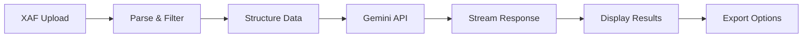

# Product Requirements Document (PRD)
## Kabisa WKR beoordelaar 2025

### 1. Product Overzicht

**Product Naam:** Kabisa WKR beoordelaar 2025  
**Versie:** 1.0  
**Datum:** September 2025

#### 1.1 Productvisie
Een MVP webapplicatie op localhost zonder user accounts of authenticatie die Nederlandse XAF (XML Audit Files) automatisch analyseert met behulp van Google Gemini AI, om boekhoudkundige inzichten op het gebied van de werkkostenregeling, anomalieën en rapportages te genereren zonder handmatige data-analyse.

#### 1.2 Doelgroep
- Accountants en boekhouders
- Financial auditors
- Financiële controllers
- MKB-bedrijven met boekhoudkundige analysebehoefte

### 2. Functionele Requirements

#### 2.1 File Upload & Processing

**User Story:** Als gebruiker wil ik een XAF bestand kunnen uploaden zodat het systeem mijn boekhouddata kan analyseren.

**Acceptatiecriteria:**
- Drag & drop interface voor .xaf bestanden
- Maximum bestandsgrootte: 100MB
- Upload progress indicator
- Validatie of bestand valide XAF XML is
- Error handling bij corrupt/invalid files

**Technische specificaties:**
```typescript
interface UploadRequirements {
  acceptedFormats: ['.xaf', '.xml'];
  maxSize: 100 * 1024 * 1024; // 100MB
  validation: 'XAF schema compliant';
}
```

#### 2.2 XAF Parsing & Filtering

**User Story:** Als gebruiker wil ik dat alleen relevante transacties worden geanalyseerd voor efficiënte verwerking.

**Filtering logica (uit bijlage):**
- Include: Account IDs beginnend met "4" (omzet rekeningen)
- Exclude: Account IDs beginnend met "49"
- Exclude: Specifieke accounts (430000, 403130)
- De boekingen worden geconverteerd naar het volgende format, per regel: Grootboek: [grootboeknummer en naam] | Boeking: [boekingnummer en omschrijving] | Bedrag: [bedrag in euros] | Datum: [datum]

**Output structuur:**
```text
| Grootboek | Boeking | Bedrag | Datum |
|---|---|---|---|
| 440000 Huur | 108308 Spitters Vastgoed BV_Kazernelaan - 2023-01-01 | 9834.5 | 2023-01-01
| 404001 Leasekosten - BU - direct | 108716 VOLKSWAGEN PON FINANCIAL SERVICES - 2023-01-01 | 892.5 | 2023-01-03
| 404001 Leasekosten - BU - direct | 108741 zuidlease - 2023-01-01 | 646.17 | 2023-01-03
| 450009 Overige saleskosten | 108761 Leadinfo maandelijks abonnement Disable Lead Gen Form branding Screen recording | 472.99 | 2023-01-03
| 430004 Domeinregistratie | 108764 transip - 2023-01-01 | 140.34 | 2023-01-03
| 403000 Kantinekosten - Te verdelen | 108767 Jumbo Supermarkten - 2023-01-02 | 120.6 | 2023-01-03
| 431000 Telefoonkosten | 109038 voys - 2023-01-03 | 64.79 | 2023-01-05
```

#### 2.3 Gemini AI Integration

**User Story:** Als gebruiker wil ik AI-gegenereerde inzichten over mijn boekhouddata ontvangen, over de werkkostenregeling.

**Gemini configuratie:**
- Model: `gemini-2.5-pro`
- Referentie documenten:
  - plan/wkr1.pdf
  - plan/wkr2.pdf

**Output structuur:**
- Markdown, inclusief tabellen

**Analyse prompts:**
```typescript
interface AnalysisTypes {
  standard: "
    Voor elke boeking:
    Valt de boeking onder de werkkostenregeling? 
    Hoe zeker ben je? in een percentage.
    Is er een gerichte vrijstelling van toepassing?
    Geef de specifieke boekingen terug welke onder een vrijstellingsregeling vallen of waar je over twijfelt.
    Bereken de vrije ruimte basis van de loonkosten.
    Als laatste geef je aan hoeveel gebruik er wordt gemaakt in de vrije ruimte met deze boekingen.
  ";,
  compliance: "Compliance check tegen Nederlandse regelgeving";
}
```

#### 2.4 Streaming Output Interface

**User Story:** Als gebruiker wil ik real-time de AI-analyse zien verschijnen tijdens het genereren.

**UI Requirements:**
- Streaming markdown renderer
- Progress indicators per analyse-sectie
- Interactieve grafieken voor kwantitatieve data

**Response structuur:**
```typescript
interface StreamingResponse {
  sections: {
    summary: string;
    keyFindings: Finding[];
    anomalies: Anomaly[];
    recommendations: string[];
    visualizations: ChartData[];
  };
}
```

### 3. Niet-Functionele Requirements

#### 3.1 Performance
- Upload processing: < 5 seconden voor 50MB file
- Gemini response start: < 2 seconden
- Complete analyse: < 30 seconden voor standaard XAF

#### 3.2 Security & Privacy
- **GDPR Compliant**: Geen permanente opslag van boekhouddata
- **Encryptie**: TLS 1.3 voor alle data transfer
- **Session-based**: Data wordt na 1 uur automatisch verwijderd
- **API keys**: Server-side only, environment variables
- **Data residency**: EU servers voor Nederlandse klanten

#### 3.3 Schaalbaarheid
- Concurrent users: 5+
- Rate limiting: 10 analyses per gebruiker per uur
- Queue systeem voor piekbelasting

### 4. Technische Architectuur

#### 4.1 Tech Stack
```typescript
interface TechStack {
  frontend: {
    framework: "Next.js 14+";
    ui: "Tailwind CSS + shadcn/ui";
    charts: "Recharts";
    state: "Zustand";
  };
  backend: {
    runtime: "Node.js";
    api: "Next.js API Routes";
    validation: "Zod";
  };
  ai: {
    provider: "Google Gemini API";
    model: "gemini-2.5-pro";
    streaming: "Server-Sent Events";
  };
  infrastructure: {
    hosting: "No hosting yet, only localhost";
  };
}
```

#### 4.2 Data Flow


### 5. User Interface Design

#### 5.1 Pagina's & Flows

**Landing Page:**
- Hero met value proposition
- Upload zone (prominent)
- Voorbeeld analyses
- Pricing/Features

**Analyse Dashboard:**
- 3-kolom layout:
  - Links: Upload status & metadata
  - Midden: Streaming AI output
  - Rechts: Quick stats & charts

**Export Modal:**
- Format selectie (Markdown, PDF)
- Branding opties

### 6. MVP Scope

#### Phase 1 (Week 1-2)
- [ ] Basic XAF upload & parsing
- [ ] Gemini integration setup
- [ ] Simple streaming output
- [ ] Basis UI met Tailwind

#### Phase 2 (Week 3-4)
- [ ] Referentie documenten toevoegen
- [ ] Geavanceerde filtering opties
- [ ] Visualisaties (basic charts)
- [ ] Export functionaliteit

#### Phase 3 (Week 5-6)
- [ ] User accounts & history
- [ ] Batch processing
- [ ] API voor integraties
- [ ] Advanced analytics

### 7. Success Metrics

- **Adoption:** 10+ uploads in eerste maand
- **Accuracy:** 95% correcte anomalie detectie
- **Performance:** <30 sec gemiddelde analysetijd
- **User Satisfaction:** NPS score > 8

### 8. Risico's & Mitigatie

| Risico | Impact | Kans | Mitigatie |
|--------|--------|------|-----------|
| Gemini API limieten | Hoog | Medium | Caching, queue systeem |
| XAF format variaties | Medium | Hoog | Robuuste parser, error handling |
| Kosten Gemini API | Medium | Medium | Usage-based pricing model |

### 9. Development Roadmap

```typescript
const roadmap = {
  "Sprint 1": ["Setup Next.js", "XAF parser", "Basic UI"],
  "Sprint 2": ["Gemini integration", "Streaming setup"],
  "Sprint 3": ["Referentie docs", "Advanced filtering"],
  "Sprint 4": ["Charts", "Export features"],
  "Sprint 5": ["Testing", "Documentation"]
};
```

### 10. Appendix

#### A. XAF Schema Referentie
- [Nederlandse Taxonomie Project](https://www.nltaxonomie.nl/)
- [SBR Standaard](https://www.sbr-nl.nl/)

#### B. Gemini Prompt Templates
```typescript
const basePrompt = `
Je bent een gespecialiseerde fiscalist. Je krijgt financiele boekingen als input en bepaalt:

1. **Valt de boeking onder de werkkostenregeling?** 
2. **Hoe zeker ben je?** Een percentage.
3. **Is er een gerichte vrijstelling van toepassing?**

Je ontvangt de boekingen in het volgende format, per regel: Grootboek: [grootboeknummer en naam] | Boeking: [boekingnummer en omschrijving] | Bedrag: [bedrag in euros] | Datum: [datum]

Dit doe je altijd op boeking niveau en geef de specifieke boekingen terug welke onder een vrijstellingsregeling vallen of waar je over twijfelt. 

Bereken de vrije ruimte basis van de loonkosten.

Als laatste geef je aan hoeveel gebruik er wordt gemaakt in de vrije ruimte met deze boekingen.

GEBRUIK NOOIT HET INTERNET OM TE ZOEKEN


Gebruik Nederlandse boekhoudterminologie.
Data: ${JSON.stringify(records)}

Geef gestructureerde output met:
1. Samenvatting
2. Belangrijkste bevindingen
3. Aandachtspunten
4. Aanbevelingen
`;
```
